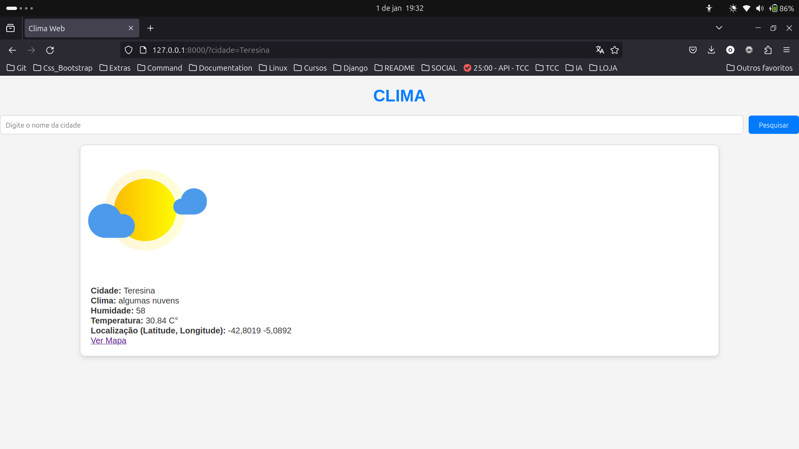
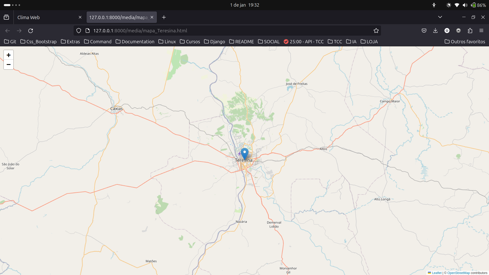

# Web Climate





## Descrição

Web Climate é um site que mostra o clima de qualquer cidade do mundo, com Geolocalização.


## Tecnologia


## Rodando localmente

Clone o projeto

```bash
  git clone https://github.com/Wenderson-Oscar/Web_Climate.git
```

Entre no diretório do projeto

```bash
  cd Web_Climate
```

Crie um ambiente virtual

```bash
  virtualenv env
```

Ative o ambiente virtual

Windows
```bash
  env\Scripts\activate
```

Linux
```bash
  . env/bin/activate
```

Instale as dependências

```bash
  pip install -r requirements.txt
```

### Variavel de ambiente

#### Primeiro Passo

- Crie um arquivo .env na raiz do projeto com as seguintes variaveis:

```bash
API_KEY = 'Chave_API'
SECRET_KEY = 'Chave_Secreta_django'
```

#### Segundo Passo

Abra um navegador da web e acesse um gerador de chaves aleatórias, como o [Djecrety](https://djecrety.ir/).

 Depois de copiar a chave coloque no arquivo .env em `SECRET_KEY = 'Chave_Secreta_django'`

#### Terceiro Passo

Acesse o seguinte link para criar a chave da api do clima. (Primeiro Crie a conta e depois a chave) [OpenWeather](https://home.openweathermap.org/api_keys).

 Depois de copiar a chave coloque no arquivo .env em `API_KEY = 'Chave_API'`

### Inicializar o servidor

```bash
python manage.py migrate
python manage.py runserver
```

## Licença

[MIT](https://choosealicense.com/licenses/mit/)
